+++
title = "MySQL 学习笔记"
date = 2026-07-12
draft = false
tags = ["MySQL", "数据库", "笔记", "索引", "事务", "MVCC", "InnoDB"]
categories = ["数据库"]
summary = "MySQL 从基础 SQL 语法到存储引擎、索引、事务、MVCC、锁机制的完整学习笔记, 含 ACID 原理与日志体系,"
ShowToc = true
TocOpen = true
+++

## 目录

1. [基础概念与连接](#1-基础概念与连接)
2. [SQL 语句分类与语法](#2-sql-语句分类与语法)
3. [MySQL 整体架构](#3-mysql-整体架构)
4. [存储引擎](#4-存储引擎)
5. [索引](#5-索引)
6. [性能分析与 SQL 优化](#6-性能分析与-sql-优化)
7. [视图 View](#7-视图-view)
8. [存储过程 Procedure](#8-存储过程-procedure)
9. [触发器 Trigger](#9-触发器-trigger)
10. [锁机制](#10-锁机制)
11. [InnoDB 事务原理与日志体系](#11-innodb-事务原理与日志体系)
12. [MVCC 多版本并发控制](#12-mvcc-多版本并发控制)
13. [系统数据库与常用工具](#13-系统数据库与常用工具)
14. [核心知识脑图总览](#14-核心知识脑图总览)

---

## 1. 基础概念与连接

### 1.1 什么是 SQL

- **SQL（Structured Query Language，结构化查询语言）**：用来和关系型数据库"对话"的标准语言。无论增删改查还是建库建表，都要通过 SQL 完成。
- **关系型数据库**：以"二维表（行 × 列）"形式组织数据，表与表之间通过外键等关系关联。MySQL 是最典型的关系型数据库之一。

### 1.2 变量分类（容易混淆，需牢记）

| 变量类型 | 写法 | 作用范围 | 说明 |
|---------|------|---------|------|
| 局部变量 | `DECLARE x ...` | 仅限 BEGIN...END 块内 | 存储过程/函数内部用，必须先 declare 再使用 |
| 会话变量 | `@x` | 当前会话（连接） | 一个连接内有效，连接断开即消失 |
| 系统变量 | `@@x` | 全局/会话 | MySQL 服务器层面的配置参数，分 GLOBAL 和 SESSION 两种 |

> **为什么要区分？** 因为不同变量的"生命周期"不同：局部变量用完即销毁、会话变量随连接消失、系统变量随服务器存在。搞混会导致存储过程里取不到值等 bug。

### 1.3 连接 MySQL（Docker 方式）

```bash
docker exec -it mysql84 mysql -uroot -p123456
```

- `docker exec -it`：进入正在运行的容器并分配交互终端。
- `mysql84`：容器名。
- `-uroot -p123456`：用户名 root、密码 123456。

---

## 2. SQL 语句分类与语法

按功能分为四大类，理解分类有助于知道"哪类语句做什么事"：

| 分类 | 全称 | 作用 | 关键字 |
|------|------|------|--------|
| **DDL** | Data Definition Language 数据定义语言 | 定义/修改表结构（库表本身） | create、alter、drop |
| **DML** | Data Manipulation Language 数据操作语言 | 操作表里的"数据" | insert、delete、update、select |
| **DQL** | Data Query Language 数据查询语言 | 查询（有时并入 DML） | select |
| **DCL** | Data Control Language 数据控制语言 | 权限与事务控制 | grant、revoke、commit、rollback |
| 其他 | — | 辅助语句 | use、show、set |

> **DDL vs DML 的本质区别**：DDL 操作的是"表结构"（有几列、什么类型），DML 操作的是"表里的数据"（哪一行哪一列的值）。

### 2.1 DDL 常用语法（alter 系列）

```sql
-- 新增字段
alter table 表名 add 字段名 数据类型;

-- 删除字段
alter table 表名 drop 字段名;

-- 把字段放到最前面
alter table 表名 add 字段名 数据类型 first;

-- 把字段放到某字段后面
alter table 表名 add 字段名 数据类型 after 另一字段;

-- 修改字段数据类型
alter table 表名 modify 字段名 新数据类型;

-- 修改字段名（同时可改类型）
alter table 表名 change 旧字段名 新字段名 新数据类型;

-- 修改表名
alter table 旧表名 rename 新表名;
```

> **MODIFY vs CHANGE 的区别（易考点）**：
> - `MODIFY` 只能改数据类型，不能改字段名。
> - `CHANGE` 既能改字段名也能改数据类型（必须写两次字段名）。

### 2.2 约束（建表时保证数据合法性）

约束是表层的规则，用来防止脏数据写进数据库。**为什么需要约束？** 应用层校验不可靠（可能绕过），数据库层约束是最后一道防线。

| 约束 | 关键字 | 作用 | 说明 |
|------|--------|------|------|
| 主键约束 | `PRIMARY KEY` | 唯一标识一行，非空+唯一 | 一表一个，通常自增 |
| 非空约束 | `NOT NULL` | 该列不能为 NULL | NULL 表示"未知"，与空字符串不同 |
| 唯一约束 | `UNIQUE` | 该列值不能重复，但允许 NULL | 一列可有多个 NULL |
| 默认约束 | `DEFAULT` | 不传值时用默认值 | 如 `DEFAULT 0` |
| 外键约束 | `FOREIGN KEY` | 引用另一表的主键，保证参照完整性 | InnoDB 支持，MyISAM 不支持 |
| 检查约束 | `CHECK` | 自定义条件（MySQL 8.0.16 起真正生效） | 如 `CHECK(age > 0)` |

```sql
create table t_student (
    id   int primary key auto_increment,
    name varchar(50) not null,
    age  int check (age > 0 and age < 150),
    email varchar(100) unique,
    did   int,
    foreign key (did) references t_department(id)
);
```

> **外键的代价**：每次插入/更新都要去父表查一遍，有性能开销；且外键会持有锁，可能引发死锁。所以互联网高并发业务经常**不用外键，由应用层保证一致性**。

### 2.3 数据类型（建表必选）

选对类型省空间、提性能。原则：**够用就行，不要盲目用大类型**。

#### 整数类型

| 类型 | 字节 | 范围 | 用途 |
|------|------|------|------|
| `tinyint` | 1 | -128~127 | 状态值、性别 |
| `smallint` | 2 | -3万~3万 | 小范围数值 |
| `int` | 4 | -21亿~21亿 | 最常用 |
| `bigint` | 8 | 极大 | 自增主键、雪花ID |

> **int(11) 里的 11 不是长度限制！** 它只是显示宽度（配合 zerofill 补零），不影响存储范围。int 永远占 4 字节。

#### 字符串类型

| 类型 | 说明 | 适用 |
|------|------|------|
| `char(n)` | 定长字符串，不足补空格 | 长度固定（如手机号、md5） |
| `varchar(n)` | 变长字符串，按实际存储 | 大多数文本场景 |
| `text` | 大文本（最大 64KB） | 文章内容 |
| `longtext` | 超大文本（最大 4GB） | 超长文本 |

> **char vs varchar**：char 是定长，存'ab'也占 n 字节，但访问快（不用算长度）；varchar 变长，省空间，但需额外 1-2 字节存长度。**长度固定用 char，不固定用 varchar。**

> **varchar(n) 的 n 怎么定？** 按业务最大需求定，但要尽量小——索引页能装多少条取决于行长度，行越短一页装越多，IO 越少。

#### 浮点与定点

| 类型 | 说明 |
|------|------|
| `float` / `double` | 浮点数，有精度丢失 |
| `decimal(m,d)` | 定点数，精确存储，m 总位数 d 小数位 |

> **金额必须用 decimal，不能用 float/double！** 浮点数有精度丢失，`0.1+0.2` 可能不等于 `0.3`，存钱会出大问题。decimal 以字符串形式存储，精确无损。

#### 日期时间

| 类型 | 格式 | 范围 |
|------|------|------|
| `date` | YYYY-MM-DD | 日期 |
| `time` | HH:MM:SS | 时间 |
| `datetime` | YYYY-MM-DD HH:MM:SS | 日期+时间，8字节，与时区无关 |
| `timestamp` | 时间戳 | 4字节，范围到 2038 年，受时区影响 |

> **datetime vs timestamp**：timestamp 占空间小、自动更新、受时区影响，适合记录创建/修改时间；datetime 范围大、与时区无关，适合存历史时间（如生日）。

### 2.4 关联查询（JOIN）

关联查询的意义：**数据被规范化拆分到多张表后，查询时需要把它们"拼"回来**。比如员工表存部门编号，部门名在部门表里，要一起展示就要 JOIN。

```sql
select ename, did
from t_employee
inner join t_department on ...;
```

- `INNER JOIN`：取两表交集（匹配上的才出现）。
- `LEFT JOIN`：左表全保留，右表匹配不上的补 NULL。
- `RIGHT JOIN`：右表全保留，左表匹配不上的补 NULL。

> **JOIN 的执行过程**：驱动表（外层）逐行去被驱动表（内层）找匹配。**小表驱动大表**性能更好——MySQL 优化器通常会自动选，但理解原理有助于写好 SQL。

### 2.5 聚合函数 + GROUP BY + HAVING

聚合查询是统计报表的核心。**为什么需要？** 业务常要"每个部门多少人""每个品类销售额多少"，这些需要把多行"压缩"成一行的统计。

#### 聚合函数

| 函数 | 作用 |
|------|------|
| `count(*)` | 统计行数（含 NULL） |
| `count(列)` | 统计该列非 NULL 的行数 |
| `sum(列)` | 求和 |
| `avg(列)` | 平均值 |
| `max(列)` / `min(列)` | 最大/最小值 |

```sql
-- 每个部门的人数和平均薪资
select did, count(*) as cnt, avg(salary) as avg_sal
from t_employee
group by did;
```

#### GROUP BY 与 HAVING 的区别

| 子句 | 作用 | 位置 | 是否能用聚合 |
|------|------|------|-------------|
| `WHERE` | 分组**前**过滤行 | GROUP BY 前 | ❌ 不能用聚合 |
| `HAVING` | 分组**后**过滤组 | GROUP BY 后 | ✅ 可以用聚合 |

```sql
-- 查人数大于3的部门
select did, count(*) as cnt
from t_employee
where salary > 5000     -- 先过滤掉薪资<=5000的人
group by did
having count(*) > 3;    -- 再过滤掉人数<=3的组
```

> **执行顺序**：FROM → WHERE → GROUP BY → HAVING → SELECT → ORDER BY → LIMIT。记住这个顺序才能正确写复杂查询。

### 2.6 子查询

子查询是"查询里套查询"，用于一步查不出来、需要先算个中间结果的情况。

| 类型 | 说明 | 示例 |
|------|------|------|
| 标量子查询 | 返回单个值 | `where salary > (select avg(salary) from t)` |
| 列子查询 | 返回一列多行 | `where did in (select id from t where ...)` |
| 行子查询 | 返回一行多列 | `where (a,b) = (select x,y from ...)` |
| 表子查询 | 返回多行多列 | `from (select ... ) as t` |
| EXISTS 子查询 | 判断是否存在 | `where exists (select 1 from ...)` |

```sql
-- 查薪资高于平均薪资的员工
select * from t_employee
where salary > (select avg(salary) from t_employee);

-- 查有员工的部门
select * from t_department d
where exists (select 1 from t_employee e where e.did = d.id);
```

> **in vs exists**：`in` 适合外大内小（子查询结果少），`exists` 适合外小内大（外表行数少，每行去判断存在性）。本质都是"看哪边做驱动表"。

### 2.7 UNION / UNION ALL（合并结果集）

把多个 SELECT 的结果拼成一个结果集。

```sql
select name from t_employee
union
select name from t_manager;
```

| 写法 | 去重 | 性能 |
|------|------|------|
| `UNION` | ✅ 去重 | 需要排序去重，慢 |
| `UNION ALL` | ❌ 不去重 | 不排序，快 |

> **优先用 UNION ALL！** 如果确定没重复或不需要去重，用 UNION ALL 省掉排序开销。UNION 内部要做类似 DISTINCT 的操作。

### 2.8 常用函数

日常写 SQL 高频用到，查阅备用：

#### 字符串函数
| 函数 | 作用 |
|------|------|
| `concat(s1,s2)` | 拼接字符串 |
| `substring(s,start,len)` | 截取子串 |
| `upper(s)` / `lower(s)` | 转大写/小写 |
| `trim(s)` | 去首尾空格 |
| `replace(s,a,b)` | 把 s 中的 a 替换成 b |
| `length(s)` | 字符串字节数 |

#### 数值函数
| 函数 | 作用 |
|------|------|
| `round(x,d)` | 四舍五入保留 d 位 |
| `ceil(x)` / `floor(x)` | 向上/向下取整 |
| `mod(n,m)` | 取余 |
| `rand()` | 0~1 随机数 |

#### 日期函数
| 函数 | 作用 |
|------|------|
| `now()` | 当前日期时间 |
| `curdate()` / `curtime()` | 当前日期/时间 |
| `date_add(d, interval n day)` | 日期加 n 天 |
| `datediff(d1,d2)` | 两日期相差天数 |
| `date_format(d, '%Y-%m-%d')` | 格式化日期 |

#### 流程控制函数（类似 if/else）
| 函数 | 作用 | 示例 |
|------|------|------|
| `if(cond, a, b)` | 条件为真返回 a 否则 b | `if(salary>10000,'高','低')` |
| `case when ... then ... else ... end` | 多分支 | 见下 |

```sql
select name,
    case
        when salary > 20000 then '高薪'
        when salary > 10000 then '中薪'
        else '低薪'
    end as level
from t_employee;
```

### 2.9 用户与权限管理（DCL）

DCL 控制"谁能连、能干什么"。**为什么需要？** 生产环境不能让所有人都用 root，要按角色分配最小权限。

```sql
-- 创建用户
create user 'dev'@'%' identified by '123456';
-- '用户名'@'主机'：'%' 表示任意主机，'192.168.1.%' 限定网段，'localhost' 本地

-- 授权（grant 权限 on 库.表 to 用户）
grant select, insert on itcast.* to 'dev'@'%';
-- all 代表所有权限，*.* 代表所有库所有表

-- 查看权限
show grants for 'dev'@'%';

-- 撤销权限
revoke insert on itcast.* from 'dev'@'%';

-- 删除用户
drop user 'dev'@'%';

-- 修改密码
alter user 'dev'@'%' identified by 'newpass';
```

| 常用权限 | 说明 |
|---------|------|
| `all` | 所有权限 |
| `select` / `insert` / `update` / `delete` | 增删改查 |
| `create` / `alter` / `drop` | DDL |
| `grant option` | 能把自己的权限再授给别人 |

> **权限最小化原则**：只给必需的权限。开发环境给读写，生产只读账号给运维查询用，避免误删。

---

## 3. MySQL 整体架构

MySQL 从上到下分为四层，理解分层有助于定位问题到底出在哪一层：

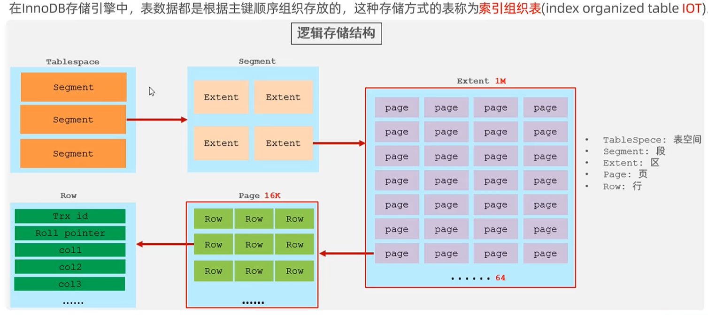

| 层 | 职责 | 说明 |
|----|------|------|
| **连接层** | 管理连接、权限校验、线程池 | 客户端连过来先在这里验证账号密码和权限 |
| **服务层** | SQL 解析、优化、执行计划 | 核心"大脑"，负责把 SQL 翻译成执行计划 |
| **引擎层** | 真正的存取数据实现 | 可插拔，InnoDB/MyISAM 等在这里 |
| **存储层** | 文件系统、磁盘 | 数据最终落盘的地方 |

> **为什么要分层？** 解耦——连接管理、SQL 解析、存储引擎各自独立，可以单独替换优化。比如换存储引擎不影响上层逻辑。

### 3.1 一条 SQL 的执行流程（服务层细节）

```
客户端
  │ SQL 语句
  ▼
查询缓存（MySQL 8.0 已废弃）→ 命中直接返回
  │ 未命中
  ▼
解析器（Parser）：词法/语法分析 → 生成解析树
  │
  ▼
预处理器：语义检查（表/列是否存在、权限校验）
  │
  ▼
优化器（Optimizer）：选择执行计划（选哪个索引、JOIN 顺序）
  │
  ▼
执行器（Executor）：调用存储引擎接口，按计划执行
  │
  ▼
存储引擎（InnoDB）：真正读写数据
```

> **为什么 MySQL 8.0 删了查询缓存？** 查询缓存命中率低、维护成本高——只要表一改，该表所有缓存全失效，在高并发写场景反而拖累性能。

> **优化器是关键**：同一条 SQL 优化器可能选不同执行计划。EXPLAIN 看到的就是优化器的决策，选错索引时可用 `force index` 纠正。

---

## 4. 存储引擎

存储引擎决定了**数据怎么存、怎么索引、怎么加锁、支不支持事务**。同一张表选不同引擎，性能和功能差异巨大。

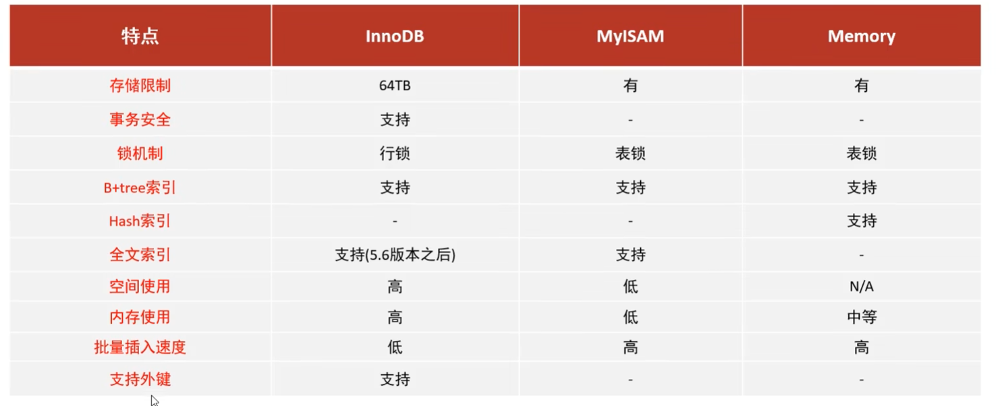

### 4.1 三大存储引擎对比

| 特性 | InnoDB | MyISAM | Memory |
|------|--------|--------|--------|
| 事务 | ✅ 支持 | ❌ 不支持 | ❌ 不支持 |
| 外键 | ✅ 支持 | ❌ 不支持 | ❌ 不支持 |
| 锁粒度 | 行级锁 | 表级锁 | 表级锁 |
| 访问速度 | 稍慢（事务开销） | 快 | 最快（在内存） |
| 适用场景 | 需要事务、高并发、数据完整性 | 只读为主、统计报表 | 临时表、缓存 |

> **为什么 InnoDB 是默认引擎？** 现代应用几乎都需要事务保证数据一致性和并发安全，InnoDB 支持事务 + 行锁 + 外键，是最"安全"的选择。MyISAM 没有事务，一旦崩溃可能丢数据，适合纯读场景。

### 4.2 事务的 ACID 特性

事务是一组操作，要么全部成功，要么全部失败回滚。为什么需要事务？**保证数据库从合法状态到合法状态，不会停留在中间错误状态**。

| 特性 | 含义 | 通俗理解 |
|------|------|---------|
| **原子性 Atomicity** | 要么全做，要么全不做 | 转账扣款和加款必须一起成功/失败 |
| **一致性 Consistency** | 执行前后数据库必须处于合法状态 | 钱不会凭空多出或少掉，约束不被破坏 |
| **隔离性 Isolation** | 多事务并发时彼此不干扰 | 你转账时别人看到的应该是"前后一致"的快照 |
| **持久性 Durability** | 提交后永久保存，崩溃也不丢 | 提交了就板上钉钉 |

> **一致性是最终目的，其他三个特性是手段**：原子性保证不半途而废、隔离性保证并发不串味、持久性保证不丢，三者共同保证一致性。

### 4.3 事务隔离级别（核心必懂）

> **为什么要有隔离级别？** 并发事务互相干扰会产生三种问题，隔离级别就是"允不允许这些问题出现"的设置。隔离级别越高越安全，但并发性越低。

#### 三种并发问题（脏读 / 不可重复读 / 幻读）

| 问题 | 含义 | 举例 |
|------|------|------|
| **脏读** | 读到了别的事务**未提交**的数据 | A 改了数据没提交，B 读到了，A 回滚 → B 读到的是脏数据 |
| **不可重复读** | 同一事务内两次读**同一行**结果不同 | A 第一次读 salary=1000，B 改成 2000 并提交，A 第二次读变成 2000 |
| **幻读** | 同一事务内两次查询，**行数**变了 | A 第一次查到 5 行，B 插入 1 行并提交，A 第二次查到 6 行（多了"幻影行"） |

> **不可重复读 vs 幻读的区别**：不可重复读是"同一行内容变了"（UPDATE），幻读是"行数变了"（INSERT/DELETE）。

#### 四个隔离级别

| 隔离级别 | 脏读 | 不可重复读 | 幻读 | 性能 |
|---------|------|-----------|------|------|
| **读未提交 Read Uncommitted** | 可能 | 可能 | 可能 | 最高 |
| **读已提交 Read Committed（RC）** | 避免 | 可能 | 可能 | 较高 |
| **可重复读 Repeatable Read（RR）** | 避免 | 避免 | 可能（SQL标准） | 中等 |
| **串行化 Serializable** | 避免 | 避免 | 避免 | 最低 |

> **MySQL 默认是 RR（可重复读）**，而 Oracle/PostgreSQL 默认是 RC。

```sql
-- 查看隔离级别
select @@transaction_isolation;

-- 设置隔离级别（全局/会话）
set global transaction isolation level read committed;
set session transaction isolation level read committed;
```

> **MySQL 的 RR 比 SQL 标准更强**：通过临键锁 + MVCC，MySQL 在 RR 级别下也能**基本避免幻读**（快照读靠 MVCC，当前读靠临键锁），这是 MySQL 的特色。

> **为什么 MySQL 选 RR 而不是 RC 作默认？** 历史原因：早期 binlog 只有 STATEMENT 格式，RC 级别下会导致主从数据不一致（从库执行顺序可能不同）。RR 级别配合 binlog 加锁能保证顺序一致。如果用 ROW 格式 binlog，RC 也可以安全使用。

---

## 5. 索引

### 5.1 索引是什么、为什么需要

- **定义**：索引是帮助 MySQL 高效获取数据的**有序数据结构**。
- **为什么需要**：没有索引时查一条数据要"全表扫描"（一行行比对），数据量大时极慢。有了索引就像字典有目录，可以快速定位，从 O(n) 降到 O(log n)。
- **代价**：索引本身要占空间，且每次增删改都要同步维护索引结构，所以不是越多越好。


### 5.2 索引的分类

| 索引类型 | 特点 | 适用场景 |
|---------|------|---------|
| **B+Tree** | 数据有序、范围查询快、叶子节点链表相连 | 绝大多数场景，InnoDB 默认 |
| **Hash** | 等值查询 O(1) 极快，不支持范围查询 | Memory 引擎、精确匹配 |
| **R-tree** | 空间数据索引 | 地理位置数据 |
| **Full-text** | 全文索引 | 文本搜索 |

按功能分：
| 分类 | 说明 |
|------|------|
| 主键索引 | 聚簇索引，一张表一个 |
| 唯一索引 | 值不能重复，允许 NULL |
| 普通索引 | 最基本的索引，无约束 |
| 联合索引 | 多列组合索引，遵循最左前缀 |
| 全文索引 | 用于全文搜索 |

### 5.3 InnoDB 的 B+Tree 结构（重点）

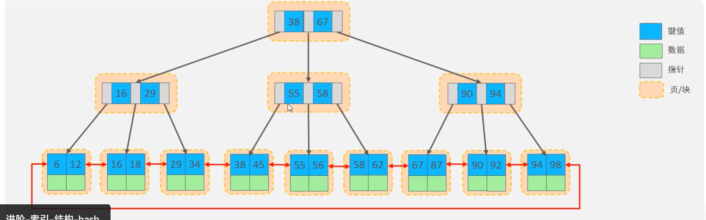

**为什么 InnoDB 用 B+Tree 而不是 B-Tree / Hash？**

1. **相比 B-Tree**：B+Tree 只有叶子节点存数据，非叶子节点只存索引 → 单个节点能装更多索引 → 树更矮 → 磁盘 IO 更少；且叶子节点用双向链表相连 → 范围查询（between、>、<）极快。
2. **相比 Hash**：Hash 不支持范围查询和排序，只能等值匹配，而业务中范围查询非常多。

> **InnoDB 的 B+Tree 叶子节点存的是"整行数据"（聚簇索引）**，所以按主键查询特别快。MyISAM 的 B+Tree 叶子存的是数据行地址，需要再回表。

### 5.4 聚簇索引 vs 非聚簇索引（二级索引）

- **聚簇索引**：叶子节点 = 数据行本身。一张表只有一个（通常是主键）。
- **非聚簇索引（二级索引）**：叶子节点存的是主键值，查到后还要"回表"用主键再查一次聚簇索引拿完整数据。

> **为什么要回表？** 因为数据只存一份（聚簇索引那份），二级索引只存主键引用，避免数据存两份浪费空间。

### 5.5 唯一索引 vs 普通索引（性能差异）

| 维度 | 唯一索引 | 普通索引 |
|------|---------|---------|
| 查找 | 找到一条就停（因为唯一） | 找到后还要往下找（可能有重复） |
| 插入 | 要检查唯一性，开销大 | 不检查，开销小 |
| Change Buffer | ❌ 不能用 | ✅ 能用（先缓存修改，合并后再写盘） |

> **普通索引的写性能可能远高于唯一索引**，因为能利用 Change Buffer 缓存修改操作。但业务上要保证唯一性时仍必须用唯一索引（数据库层比应用层可靠）。

### 5.6 Hash 索引

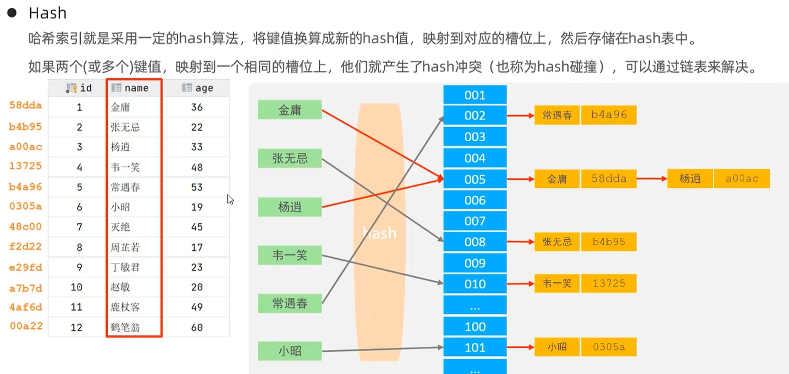

- 对索引列算 hash 值，定位到槽位。
- **优点**：等值查询极快。
- **缺点**：不支持范围、排序、最左前缀；有 hash 冲突问题。
- InnoDB 内部有个"自适应哈希索引"，对热点数据自动建 hash 加速。

---

## 6. 性能分析与 SQL 优化

### 6.1 EXPLAIN 执行计划

慢查询的第一步就是 `EXPLAIN`，它告诉你 MySQL 打算怎么执行这条 SQL。

```sql
explain select * from t where ...;
```

重点关注 **type 列**（连接类型，性能从好到差）：

| type | 含义 | 性能 |
|------|------|------|
| `NULL` | 不用访问表（如优化掉的条件） | 最好 |
| `system` | 表只有一行 | 极好 |
| `const` | 主键/唯一索引等值匹配，最多一条 | 极好 |
| `eq_ref` | 唯一索引 JOIN，每次匹配一条 | 很好 |
| `ref` | 非唯一索引等值匹配 | 好 |
| `range` | 范围扫描（between、>、<） | 一般 |
| `index` | 扫描整个索引树 | 较差 |
| `all` | 全表扫描 | 最差，要避免 |

> **目标**：至少要到 `range` / `ref` 级别，避免 `all` 全表扫描。

EXPLAIN 其他重要列：

| 列 | 含义 |
|----|------|
| `key` | 实际使用的索引（NULL 表示没用索引） |
| `key_len` | 索引使用的字节数（判断联合索引用了几列） |
| `rows` | 预估扫描行数（越小越好） |
| `Extra` | 额外信息（重点看下面几个） |

Extra 关键值：

| Extra | 含义 | 好坏 |
|-------|------|------|
| `Using index` | 覆盖索引，不回表 | 好 ✅ |
| `Using index condition` | 索引下推 ICP（见 6.7） | 较好 |
| `Using where` | 用了 where 过滤 | 一般 |
| `Using filesort` | 额外排序 | 差 ❌ |
| `Using temporary` | 用了临时表（如 group by、distinct） | 差 ❌ |

### 6.2 索引使用进阶规则

#### 最左前缀法则
对于联合索引 `(a, b, c)`，查询必须从最左列开始才能用到索引：
- ✅ `WHERE a=?` 、`WHERE a=? AND b=?`、`WHERE a=? AND b=? AND c=?` 能用
- ❌ `WHERE b=?` 跳过了 a，用不到索引
- ⚠️ `WHERE a=? AND c=?` 只能用 a 部分

> **为什么？** B+Tree 是按索引列顺序排列的，跳过第一列就没法利用有序性了。

#### SQL 提示（人为控制索引选择）
```sql
select * from t use index(idx_name) where ...;    -- 建议用某索引
select * from t ignore index(idx_name) where ...; -- 忽略某索引
select * from t force index(idx_name) where ...;  -- 强制用某索引
```
> 当优化器选错索引时，可以用这些提示纠正。

#### 覆盖索引
查询的列都包含在索引里，**不需要回表**，性能最好。
```sql
-- 假设有联合索引 (name, age)
select name, age from t where name=?;  -- 覆盖索引，不回表 ✅
select * from t where name=?;          -- 要回表取其他列 ❌
```
> **为什么快？** 省掉了回表的随机 IO，是 SQL 优化的高频手段。

#### 前缀索引
对长字符串列（如 URL、email），只索引前面一段：
```sql
alter table t add index idx_url(url(20));
```
> **为什么？** 长字段全列索引占空间大、维护慢，前缀够区分即可。

#### 索引失效的常见场景（避坑）

| 场景 | 原因 | 示例 |
|------|------|------|
| 对索引列做运算/函数 | 破坏了有序性 | `where id+1 = 10`（应写 `id = 9`） |
| 隐式类型转换 | varchar 列没加引号 | `where phone = 13800000000`（phone 是 varchar） |
| 模糊查询以 % 开头 | B+Tree 没法定位 | `where name like '%abc'` |
| or 两边不全有索引 | 有一边全表扫就全扫 | `where a=1 or b=2`（b 无索引） |
| != / not in / is not null | 范围太广，优化器放弃索引 | `where status != 1` |

> **核心原理**：索引能用的前提是"能借助有序性快速定位"，一旦运算/转换/通配符破坏了这个前提，索引就失效了。

### 6.3 SQL 优化要点

#### INSERT 优化
1. **批量插入**：一条 INSERT 多个 VALUES，减少语句解析和网络往返次数。
2. **手动提交事务**：`start transaction; ...一堆insert... commit;` 避免每条自动提交都写一次 redo log。
3. **主键顺序插入**：按主键递增顺序插入，避免页分裂。

> **为什么顺序插入快？** InnoDB 数据按主键聚簇存储，乱序插入会导致数据页写满后"分裂"出新页（页分裂），顺序插入则顺序追加，效率高。

#### 主键优化：页分裂与页合并

| 现象 | 触发原因 | 影响 |
|------|---------|------|
| **页分裂** | 数据页满了还要往中间插入 | 需要新建页并搬移数据，开销大 |
| **页合并** | 删除数据后页内数据少于阈值 | 相邻页合并，释放空间 |

> **所以主键设计原则**：用自增整型主键（连续、占空间小），避免用 UUID 等无序值做主键。

#### ORDER BY 优化
EXPLAIN 里 `Extra` 列会出现两种情况：

| Extra | 含义 | 性能 |
|-------|------|------|
| `Using index` | 直接利用索引有序性，不用额外排序 | 好 ✅ |
| `Using filesort` | 索引帮不上，要在内存/磁盘排序 | 差 ❌ |

> **优化方向**：让 order by 的字段走索引（覆盖索引），避免 filesort。注意 order by 字段顺序要和联合索引顺序一致。

### 6.4 ⚠️ 行锁升级为表锁（重要陷阱）

> **InnoDB 的行锁是针对"索引"加的锁，不是针对"记录"加的锁。如果索引失效（如类型不匹配、用了函数），行锁会升级为表锁，锁住整张表，并发性骤降。**

例如 `WHERE phone = 13800000000`，如果 phone 是 varchar 但没加引号，发生隐式类型转换，索引失效 → 行锁变表锁。

### 6.5 慢查询日志（调优第一步）

> **定位慢 SQL 的核心工具。** 开启后 MySQL 会把超过阈值的 SQL 记录到日志文件，分析它就能找到需要优化的 SQL。

```sql
-- 查看是否开启
show variables like 'slow_query_log';

-- 开启慢查询日志
set global slow_query_log = on;

-- 设置阈值（默认 10 秒，生产通常设 1 秒或更短）
set global long_query_time = 1;

-- 查看日志文件位置
show variables like 'slow_query_log_file';
```

也可以在 my.cnf 配置文件永久生效：
```ini
[mysqld]
slow_query_log = 1
long_query_time = 1
log_queries_not_using_indexes = 1   # 没用索引的查询也记录
```

> **分析工具**：`mysqldumpslow` 可以汇总慢查询日志，按耗时/次数排序，快速找出最需要优化的 SQL。

### 6.6 索引下推 ICP（Index Condition Pushdown）

> **MySQL 5.6 引入的优化，减少回表次数。**

**没有 ICP 时**：联合索引 `(name, age)` 查 `where name like '张%' and age=20`：
1. 用 name 的前缀在索引里找到所有"张%"的记录（可能很多条）
2. **逐条回表**取完整行
3. 再用 age=20 过滤 → 大量无意义回表

**有 ICP 时**：
1. 用 name 的前缀在索引里找到"张%"的记录
2. **在索引层就用 age=20 过滤**（因为 age 也在联合索引里）
3. 只对满足条件的记录回表 → 回表次数大幅减少

> **判断**：EXPLAIN 的 Extra 显示 `Using index condition` 就是用了 ICP。

### 6.7 count 优化（count(*) vs count(1) vs count(列)）

| 写法 | 含义 | 是否统计 NULL | 性能 |
|------|------|--------------|------|
| `count(*)` | 统计总行数 | ✅ 包含 NULL | 最好（MySQL 专门优化） |
| `count(1)` | 统计行数（每行恒为 1） | ✅ 包含 NULL | 与 count(*) 接近 |
| `count(主键)` | 统计主键非 NULL 行数 | ❌ 不含 NULL | 略慢（要解析主键值） |
| `count(普通列)` | 统计该列非 NULL 行数 | ❌ 不含 NULL | 最慢（要判断每行是否 NULL） |

> **MySQL 8.0.13+ 并行扫描优化**：InnoDB 的 `count(*)` 不再需要逐行扫，性能已大幅提升。日常用 `count(*)` 即可，不要用 `count(列)` 除非确实要排除 NULL。

> **为什么 count 慢？** InnoDB 没有维护"总行数"（MyISAM 有），count 要遍历聚簇索引。大表 count 可以用估算值（`show table status`）或缓存。

### 6.8 深分页优化（limit 百万级慢的原因和解法）

```sql
-- 这个查询极慢
select * from t order by id limit 1000000, 10;
```

> **为什么慢？** MySQL 不是"跳过"前 100 万行，而是**扫描前 100 万+10 行然后丢弃前 100 万行**，扫描和回表开销巨大。

**解法 1：子查询 + 覆盖索引**
```sql
-- 先用覆盖索引快速定位第 100 万个 id，再取 10 条
select * from t
where id > (select id from t order by id limit 1000000, 1)
limit 10;
```
> 子查询只走索引不回表，定位到 id 后主查询直接按主键取，极快。

**解法 2：记住上一页的最大 id（推荐，适用于连续翻页）**
```sql
-- 前端传上次最后一条的 id
select * from t where id > #{last_id} order by id limit 10;
```
> 每次都是 `where id > 上次最大id limit 10`，不管翻到第几页都一样快。缺点是不能跳页。

---

## 7. 视图 View

### 7.1 什么是视图、为什么需要

- **视图**：一张"虚拟表"，本质是一条保存起来的 SELECT 语句的结果。
- **为什么需要**：
  - **简单**：把复杂的多表 JOIN 查询封装成视图，使用者只需 `select * from 视图名`，不用每次写长 SQL。
  - **安全**：可以只暴露部分列/行给用户，隐藏敏感字段。数据库只能授权到表级，无法授权到行/列级，但视图可以做到"行列级权限控制"。
  - **数据独立**：底层表结构变了，只要视图定义不变，应用层不受影响。

> MySQL 允许**基于另一个视图再创建视图**（视图套视图）。

### 7.2 检查选项 WITH CHECK OPTION

当视图带 WHERE 条件时，通过视图 INSERT/UPDATE 的数据必须满足 WHERE 条件，否则报错。检查范围分两种：

| 选项 | 检查范围 | 通俗理解 |
|------|---------|---------|
| `CASCADED` | 当前视图 + **所有底层视图**的 WHERE 条件 | 递归往上全部检查（不管底层视图有没有定义 check option） |
| `LOCAL` | 当前视图 + **底层视图自身也定义了 WITH CHECK OPTION 的** | 只检查"明确要求检查"的视图 |

```
WITH CHECK OPTION         -- 默认是 CASCADED
WITH CASCADED CHECK OPTION
WITH LOCAL CHECK OPTION
```

> **区别举例**：假设视图 A（无 check）← 视图 B（有 check）。
> - 用 CASCADED：插入数据时 A、B 的 WHERE 都要满足。
> - 用 LOCAL：插入数据时只需满足 B（因为 A 没声明 check option，被跳过）。

### 7.3 视图更新的限制

> **视图中的行与基础表中的行必须存在"一对一"关系，视图才能更新。**

如果视图包含以下情况，则不可更新：
- 聚合函数（SUM/COUNT 等）、DISTINCT、GROUP BY、HAVING、UNION
- 常量视图、JOIN 的某些情况

> **为什么？** 一对多或多对多时，改视图一行不知道对应基础表哪一行，无法安全更新。

---

## 8. 存储过程 Procedure

### 8.1 是什么、为什么用

- **存储过程**：预先编译好并存储在数据库中的一段 SQL 语句集合，通过 `CALL` 调用。
- **为什么需要**：
  - **封装与重用**：把业务逻辑封装在数据库端，应用层只需调用名字。
  - **减少网络交互**：多条 SQL 不用一次次传到数据库，一次调用即可，降低网络延迟。
  - **预编译**：编译一次多次执行，效率高。

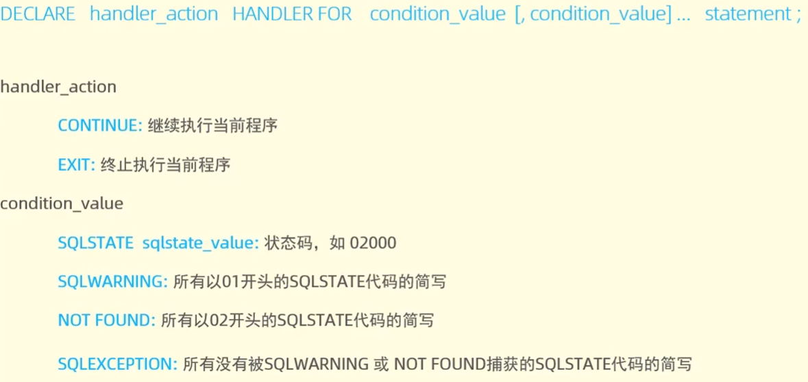

### 8.2 核心语法要素

| 要素 | 作用 |
|------|------|
| `DECLARE` | 声明局部变量（只在 BEGIN...END 内有效） |
| 变量作用域 | `global` 全局 / `session` 会话 / 局部变量 |
| `LOOP` | 循环结构 |
| `LEAVE` | 跳出循环（相当于 break） |
| `ITERATE` | 跳过本次进入下次（相当于 continue） |
| `CURSOR 游标` | 用来逐行遍历查询结果集（普通 SQL 是面向集合的，游标让它能"逐行处理"） |
| `HANDLER 条件处理程序` | 异常处理（相当于 try-catch），处理 NOT FOUND / SQLEXCEPTION 等 |

> **游标为什么存在？** 普通 SQL 一次处理整个结果集，但有些逻辑需要逐行判断处理（如逐行计算），游标提供了这种能力。代价是性能不如集合操作，应尽量少用。

---

## 9. 触发器 Trigger

### 9.1 是什么、为什么用

- **触发器**：与表绑定的数据库对象，在 INSERT/UPDATE/DELETE **之前或之后**自动触发执行一段 SQL。
- **为什么需要**：在数据库端自动保证**数据完整性、日志记录、数据校验**，不依赖应用层记得调用。

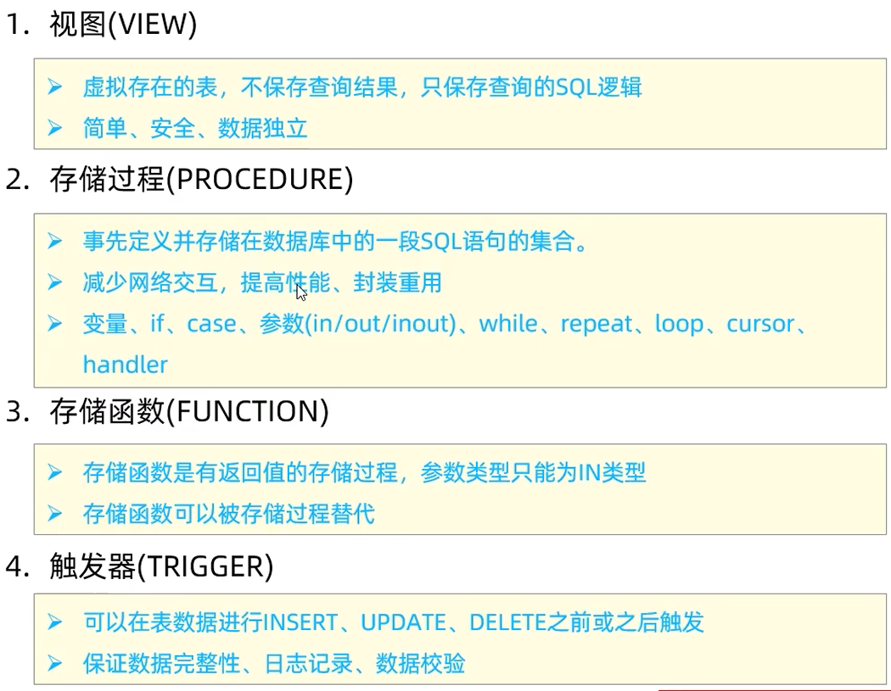

### 9.2 触发时机与级别

| 维度 | 取值 |
|------|------|
| 触发时间 | `BEFORE` / `AFTER` |
| 触发事件 | `INSERT` / `UPDATE` / `DELETE` |
| 触发级别 | **行级（FOR EACH ROW）** —— MySQL 目前只支持行级，不支持语句级 |

> **行级 vs 语句级**：一条 UPDATE 影响 10 行，行级触发器触发 10 次，语句级触发器只触发 1 次。MySQL 只支持行级，所以批量操作时触发器会执行很多次，要注意性能。

> **典型用途**：删用户时自动往日志表插一条记录；更新库存前检查是否超卖。

---

## 10. 锁机制

### 10.1 锁是什么、为什么需要

> **锁是协调多个进程/线程并发访问同一资源的机制。** 没有锁，并发修改会导致数据错乱（脏写、丢失更新）。

### 10.2 锁的三个粒度

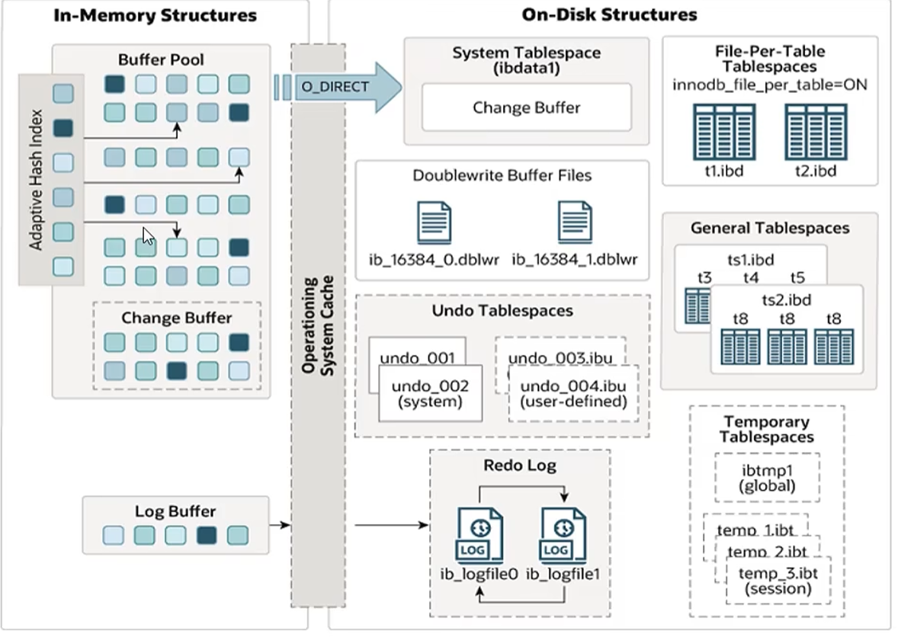

#### 全局锁
- **用途**：全库逻辑备份，锁定所有表获得一致性视图，保证备份数据完整一致。
- **命令**：
```bash
mysqldump -uroot -p123456 itcast > itcast.sql
# 备份完成后
unlock tables;
```
> **代价**：整个数据库只能读不能写，业务停摆。生产环境一般用 `--single-transaction`（利用事务一致性读）替代，避免锁全库。

#### 表级锁
- **用法**：`lock tables xxx read/write;`
- **读锁（共享锁）**：自己能读不能写，别人能读不能写。
- **写锁（排他锁）**：自己能读写，别人不能读写。
- MyISAM 默认就是表锁。
- **MDL（元数据锁）**：MySQL 5.5+ 自动加的，操作表时防止别人改表结构。这是为什么长事务会阻塞 DDL 的原因。

#### 行级锁（InnoDB 核心）
行锁分三种，理解它们对解决并发问题至关重要：

| 锁类型 | 锁定范围 | 作用 |
|--------|---------|------|
| **记录锁 Record Lock** | 锁住单条索引记录 | 防止别人修改/删除这条记录 |
| **间隙锁 Gap Lock** | 锁住记录之间的"间隙"（不含记录本身） | 防止别人往间隙里 INSERT，解决幻读 |
| **临键锁 Next-Key Lock** | 记录锁 + 间隙锁（左开右闭） | RR 隔离级别下默认行锁，既防修改又防插入 |

> **为什么要间隙锁/临键锁？** 在可重复读（RR）隔离级别下，光锁住已有记录不够——别人还能往中间插入新行导致"幻读"。间隙锁把"可能插入的位置"也锁住，从而杜绝幻读。

> **回顾前文的行锁升级陷阱**：行锁是针对索引加的，索引失效就会升级成表锁——这是最容易踩的坑。

---

## 11. InnoDB 事务原理与日志体系

这是理解 MySQL 的核心。ACID 四个特性各自靠什么实现？


| 特性 | 实现机制 | 原理 |
|------|---------|------|
| **原子性** | **undo log（回滚日志）** | 记录数据的"逻辑逆操作"（旧版本数据指针），失败时反向操作回滚 |
| **持久性** | **redo log（重做日志）** | 记录"对某个页的某个位置做了什么物理修改"，崩溃重启时重做恢复 |
| **隔离性** | **锁 + MVCC** | 写操作用锁串行化，读操作用 MVCC 读快照 |
| **一致性** | 上述三者 + 约束共同保证 | 是最终目标，前三个是手段 |

### 11.1 日志体系全貌

InnoDB 有多种日志，各司其职，初学极易混淆：

| 日志 | 层级 | 作用 | 写入时机 |
|------|------|------|---------|
| **redo log** | InnoDB 引擎层 | 保证持久性，崩溃恢复 | 事务执行中不断写 |
| **undo log** | InnoDB 引擎层 | 保证原子性 + MVCC（回滚+快照） | 修改前先写 |
| **binlog** | Server 层（所有引擎共用） | 归档日志，主从复制 + 数据恢复 | 事务提交时写 |
| **慢查询日志** | Server 层 | 记录慢 SQL，调优 | 查询超阈值时 |
| **错误日志** | Server 层 | 记录启停/告警/错误 | 随时 |
| **通用查询日志** | Server 层 | 记录所有 SQL（默认关闭） | 随时 |

> **redo log vs binlog 的关键区别**：
> - redo log 是 **InnoDB 引擎层**的，binlog 是 **Server 层**的（所有引擎都用）。
> - redo log 是 **物理日志**（哪个页哪个偏移改了什么），binlog 是 **逻辑日志**（SQL 语句或行变更）。
> - redo log 是 **循环写**（覆盖旧的），binlog 是 **追加写**（不覆盖，写满新开文件）。
> - redo log 用于 **崩溃恢复**，binlog 用于 **主从复制和数据备份恢复**。

### 11.2 undo log（原子性的基石）

- 记录修改前的**旧版本数据**，并提供指向旧版本的指针。
- 作用：① 事务回滚时恢复数据；② 为 MVCC 提供历史版本（快照读的依据）。
- **它是逻辑逆操作**：比如 INSERT 对应的 undo 是 DELETE，UPDATE 对应反向 UPDATE。

### 11.3 redo log（持久性的基石）

- 记录的是**物理修改**（哪个页、哪个偏移量、改成什么），不是 SQL 语句。
- 作用：先写 redo log（WAL 机制）再刷数据页，崩溃后用 redo log 恢复已提交但没落盘的数据。
- **为什么 redo 比 直接刷数据页快？** redo log 是顺序写（追加），刷数据页是随机写，顺序写远快于随机写。
- **redo log 是循环写的**：有两个文件 ib_logfile0/1，写满一个写另一个，旧的会被覆盖（所以只用于近期崩溃恢复，不用于长期归档）。

> **WAL（Write-Ahead Logging）核心思想**：先写日志，再改数据。保证"提交了就不会丢"。

### 11.4 binlog（归档日志）

- **Server 层**的日志，所有存储引擎都會写，不只是 InnoDB。
- 记录的是**逻辑变更**，有三种格式：

| 格式 | 内容 | 优缺点 |
|------|------|--------|
| `STATEMENT` | 记 SQL 语句 | 日志小，但有些函数（如 now()、uuid()）在从库执行结果可能不一致 |
| `ROW` | 记每行的变更前后值 | 数据一致性好，但日志大 |
| `MIXED` | 混合（一般用 STATEMENT，不安全时用 ROW） | 折中 |

```sql
-- 查看 binlog 配置
show variables like 'log_bin';
show variables like 'binlog_format';
show binary logs;          -- 查看 binlog 文件列表
show binlog events in 'mysql-bin.000001';  -- 查看具体内容
```

> **为什么 binlog 这么重要？** 
> - **主从复制**：从库读主库的 binlog 重放，实现数据同步。
> - **数据恢复**：先用备份恢复全量，再用 binlog 重放到指定时间点（point-in-time recovery）。

### 11.5 两阶段提交（redo log + binlog 一致性）

> **问题**：一个事务提交时既要写 redo log 又要写 binlog，如果只写了一个就崩溃了怎么办？主库用 redo 恢复了数据，但从库用 binlog 同步不到 → 主从不一致。

**两阶段提交（2PC）保证两者一致：**

```
阶段1（Prepare）：InnoDB 写 redo log，标记为 PREPARE 状态
        │
        ▼
阶段2（Commit）：Server 层写 binlog，然后 InnoDB 把 redo log 改成 COMMIT 状态
```

崩溃恢复规则：
- **redo log 是 PREPARE 状态，binlog 完整（有这条事务）** → 提交事务（因为 binlog 已落盘，从库能同步）
- **redo log 是 PREPARE 状态，binlog 不完整（没有这条事务）** → 回滚事务（从库不会同步，主库也回滚保持一致）
- **redo log 是 COMMIT 状态** → 事务已确认提交，直接恢复

> **为什么这样能保证一致？** 以 binlog 是否写成功为准：binlog 写了就从库能同步，主库也提交；binlog 没写就从库同步不到，主库也回滚。这样主从永远一致。

### 11.6 主从复制

基于 binlog 实现，是读写分离、高可用的基础。

**复制流程：**
```
主库（Master）                    从库（Slave）
   │ binlog                          │
   │ ────────────► IO Thread ──────► │ relay log（中继日志）
   │                                 │ ──────► SQL Thread ──► 重放SQL ──► 数据
```

1. 从库的 **IO 线程** 连接主库，拉取 binlog，写入本地 **relay log（中继日志）**。
2. 从库的 **SQL 线程** 读取 relay log，重放 SQL，更新数据。

| 复制方式 | 说明 |
|---------|------|
| 异步复制（默认） | 主库写完 binlog 就返回，不等从库 → 性能高，可能主从不一致 |
| 半同步复制 | 主库至少等一个从库收到 binlog 才返回 → 折中 |
| 组复制（MGR） | 多个节点一致性协议 → 高可用 |

> **主从延迟问题**：从库重放 binlog 需要时间，主库写入后从库不能立刻看到。解决方案：读主库（关键业务）、半同步复制、并行复制。

---

## 12. MVCC 多版本并发控制

### 12.1 为什么需要 MVCC

> 没有并发就没有锁的问题。但数据库要支持高并发，如果所有读都加锁，并发性极差。**MVCC 让"读-读"和"读-写"不互相阻塞**：普通读不加锁读历史快照，写操作加锁，两者并行不冲突。这是 InnoDB 高并发的关键。

### 12.2 当前读 vs 快照读（核心区分）

#### 当前读（加锁，读最新）

当你需要**修改数据**（或为修改而读取）时，必须用当前读——因为不能基于过时快照去更新，关乎数据安全。

| 触发方式 | 说明 |
|---------|------|
| `SELECT ... FOR UPDATE` | 加排他锁，准备改 |
| `SELECT ... LOCK IN SHARE MODE` | 加共享锁，读时不许别人改 |
| `INSERT / UPDATE / DELETE` | 修改操作本身触发当前读，定位并锁定目标行 |

- 读的是**最新已提交版本**。
- 加锁方式：记录锁 / 临键锁（RR 下防幻读）。
- 读的时候别人不能改，直到事务提交释放锁。

#### 快照读（不加锁，读历史版本）

| 触发方式 | 说明 |
|---------|------|
| 普通 `SELECT`（不带 FOR UPDATE / LOCK IN SHARE MODE） | 默认快照读 |

- 读的是历史版本（快照），不加锁，性能好。
- 读哪个版本取决于隔离级别：

| 隔离级别 | ReadView 生成时机 | 效果 |
|---------|-------------------|------|
| **RR（可重复读，默认）** | 事务内**第一次**快照读生成，之后复用 | 整个事务看到同一份快照 → 可重复读，快照层面防幻读 |
| **RC（读已提交）** | **每次**快照读都重新生成 | 每次都能读到最新已提交数据 → 不可重复读 |

> **这就是为什么 RR 级别下普通 SELECT 不加锁也能看到稳定数据、避免幻读（快照读层面）。** 但要注意：当前读仍可能看到别人新插入的行，幻读的完全杜绝需要锁。

### 12.3 MVCC 实现原理（三大要素）

#### ① 隐藏字段
InnoDB 给每行记录加了三个隐藏字段：

| 隐藏字段 | 含义 |
|---------|------|
| `DB_TRX_ID` | 最近修改这条记录的事务 ID（谁改的我） |
| `DB_ROLL_PTR` | 回滚指针，指向这条记录的上一个版本（配合 undo log 形成版本链） |
| `DB_ROW_ID` | 隐藏主键（当表没有主键时 InnoDB 自动生成） |

#### ② undo log 版本链
每次修改都生成一条 undo log，通过 `DB_ROLL_PTR` 串成链表，形成一条"历史版本链"，快照读就顺着这条链找到合适的版本。

#### ③ ReadView（快照判定规则）
ReadView 是事务做快照读时生成的"可见性判断依据"，包含四个字段：

| 字段 | 含义 |
|------|------|
| `m_ids` | 当前活跃（未提交）的事务 ID 集合 |
| `min_trx_id` | 最小活跃事务 ID |
| `max_trx_id` | 预分配的下一个事务 ID（当前最大事务 ID + 1） |
| `creator_trx_id` | 创建这个 ReadView 的事务 ID（自己） |

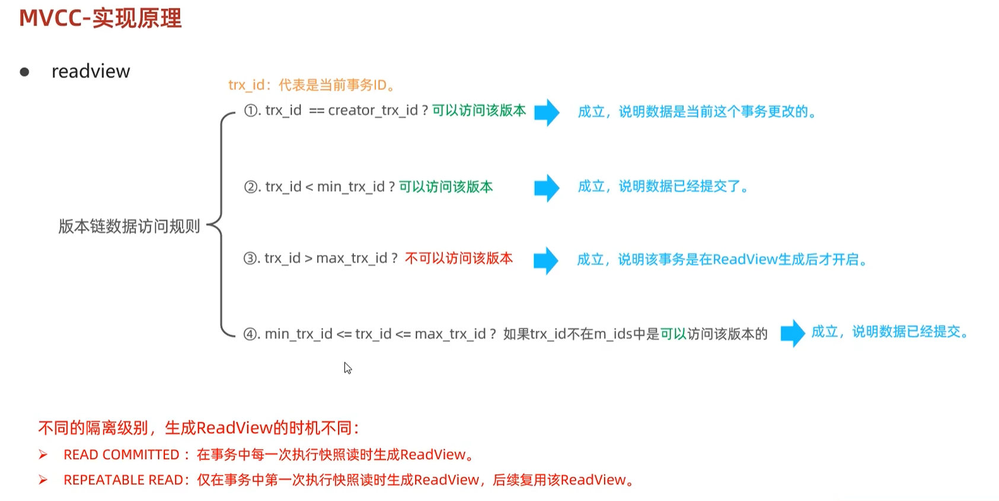

**可见性判断规则（顺着版本链找第一个可见版本）：**

对于某条记录的 `DB_TRX_ID`（记为 trx_id）：

1. `trx_id == creator_trx_id` → **自己改的，可见** ✅
2. `trx_id < min_trx_id` → 在 ReadView 生成前就已提交 → **可见** ✅
3. `trx_id >= max_trx_id` → 在 ReadView 生成后才开启的事务 → **不可见** ❌
4. `min_trx_id <= trx_id < max_trx_id`：
   - 若 trx_id **在** `m_ids` 中 → 该事务还活跃（未提交） → **不可见** ❌，顺版本链往下找
   - 若 trx_id **不在** `m_ids` 中 → 已提交 → **可见** ✅

> **理解口诀**：自己的看得见、比我老的已提交看得见、比我新或还没提交的看不见。

---

## 13. 系统数据库与常用工具

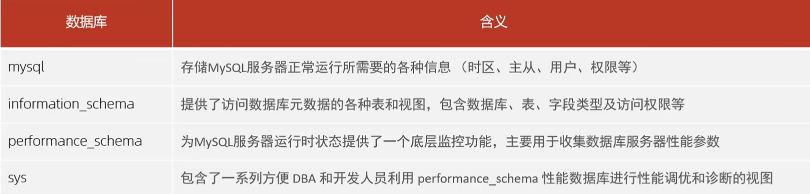

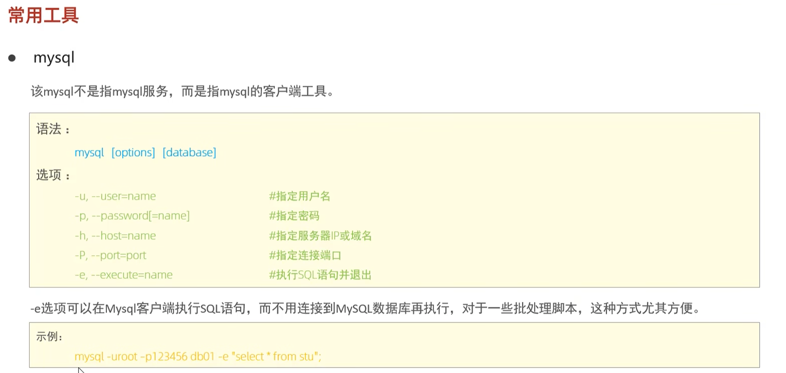

MySQL 自带几个系统库，存放元数据和服务信息：

| 系统库 | 作用 |
|-------|------|
| `information_schema` | 存放所有库/表/列/索引的元数据（只读，视图） |
| `mysql` | 存放用户、权限、时区等系统配置 |
| `performance_schema` | 性能监控数据 |
| `sys` | 基于 performance_schema 的易读视图 |

### 常用命令行工具

| 工具 | 作用 |
|------|------|
| `mysqladmin --help` | 管理工具：创建/删除库、改密码、看状态等 |
| `mysqlbinlog` | 查看/解析二进制日志（binlog），用于数据恢复和主从复制 |
| `mysqlshow` | 快速查看有哪些库、表、列、索引 |
| `mysqldump` | 逻辑备份工具，导出 SQL 文件 |
| `mysqlslap` | 压测工具 |

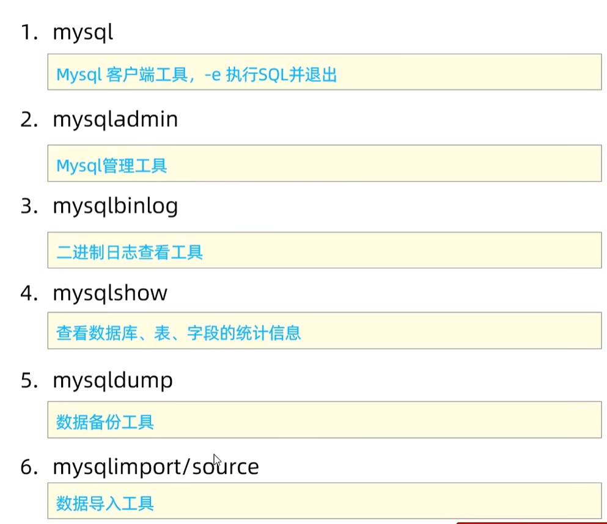

---

## 14. 核心知识脑图总览

```
MySQL 体系
├── 架构分层：连接层 → 服务层（解析/优化/执行）→ 引擎层 → 存储层
│
├── SQL 分类
│   ├── DDL（建/改/删表结构）：create / alter / drop
│   │   └── 约束：主键 / 非空 / 唯一 / 默认 / 外键 / check
│   │   └── 数据类型：int / varchar / char / decimal / datetime / text
│   ├── DML（操作数据）：insert / delete / update / select
│   │   ├── JOIN：inner / left / right
│   │   ├── 聚合：count/sum/avg/max/min + group by + having
│   │   ├── 子查询：标量/列/行/表/exists
│   │   ├── union / union all
│   │   └── 常用函数：字符串/数值/日期/if/case
│   ├── DCL（权限/事务）：grant / revoke / commit / rollback
│   │   └── 用户管理：create user / grant / revoke
│   └── 其他：use / show / set
│
├── 存储引擎
│   ├── InnoDB（默认）：事务 + 行锁 + 外键 → 数据安全
│   ├── MyISAM：表锁、无事务 → 只读快
│   └── Memory：内存存储、hash索引 → 临时缓存
│
├── 事务
│   ├── ACID 特性
│   │   ├── 原子性 → undo log
│   │   ├── 持久性 → redo log
│   │   ├── 一致性 → AID + 约束（最终目标）
│   │   └── 隔离性 → 锁 + MVCC
│   ├── 隔离级别（默认 RR）
│   │   ├── 读未提交：脏读+不可重复读+幻读
│   │   ├── 读已提交 RC：避免脏读
│   │   ├── 可重复读 RR：避免脏读+不可重复读（MySQL 还基本防幻读）
│   │   └── 串行化：全避免，性能最低
│   └── 日志体系
│       ├── redo log（引擎层/物理/循环写）→ 崩溃恢复
│       ├── undo log（引擎层/逻辑）→ 回滚 + MVCC
│       ├── binlog（Server层/逻辑/追加写）→ 主从复制 + 数据恢复
│       └── 两阶段提交：保证 redo + binlog 一致
│
├── 索引（有序数据结构，加速查询）
│   ├── 类型：B+Tree（主流）/ Hash / R-tree / Full-text
│   ├── InnoDB B+Tree：叶子存整行（聚簇索引），链表相连支持范围查询
│   ├── 聚簇 vs 二级索引：二级索引需回表
│   ├── 唯一 vs 普通：唯一查找到即停，普通可用 change buffer
│   ├── 使用规则：最左前缀 / 覆盖索引 / 前缀索引 / SQL提示
│   ├── 索引下推 ICP：索引层过滤，减少回表
│   ├── 索引失效：运算/函数/类型转换/%开头/or/!=
│   └── ⚠️ 索引失效 → 行锁升级为表锁
│
├── 性能优化
│   ├── EXPLAIN：type 从好到差 const > ref > range > index > all
│   ├── 慢查询日志：定位慢 SQL
│   ├── INSERT：批量插入 / 手动事务 / 主键顺序插入（避免页分裂）
│   ├── ORDER BY：争取 Using index，避免 Using filesort
│   ├── 主键：自增整型，避免无序值
│   ├── count(*)：MySQL 优化过，优先用
│   ├── 深分页：子查询+覆盖索引 / 记住上次最大id
│   └── 优化器选错索引 → use/ignore/force index
│
├── 数据库对象
│   ├── 视图 View：虚拟表，简化查询/安全/数据独立
│   │   ├── WITH CHECK OPTION：cascaded（全检查）/ local（部分检查）
│   │   └── 可更新条件：视图行与基础表行一对一
│   ├── 存储过程 Procedure：预编译、封装重用、减少网络交互
│   │   └── 变量/loop/leave/iterate/游标/handler
│   └── 触发器 Trigger：INSERT/UPDATE/DELETE 前/后自动执行
│       └── MySQL 只支持行级触发
│
├── 锁（协调并发访问）
│   ├── 全局锁：全库备份（mysqldump）
│   ├── 表级锁：lock tables read/write + MDL元数据锁
│   └── 行级锁（InnoDB）
│       ├── 记录锁 Record Lock：锁单行
│       ├── 间隙锁 Gap Lock：锁间隙防插入
│       └── 临键锁 Next-Key Lock：记录+间隙，RR 下防幻读
│
├── MVCC（多版本并发控制，让读写不阻塞）
│   ├── 当前读（加锁，读最新）：FOR UPDATE / LOCK IN SHARE MODE / 增删改
│   ├── 快照读（不加锁，读历史）：普通 SELECT
│   │   ├── RR：事务内复用同一 ReadView → 可重复读 + 防幻读
│   │   └── RC：每次新建 ReadView → 读已提交
│   └── 实现三要素
│       ├── 隐藏字段：DB_TRX_ID / DB_ROLL_PTR / DB_ROW_ID
│       ├── undo log 版本链：通过回滚指针串联历史版本
│       └── ReadView：m_ids / min_trx_id / max_trx_id / creator_trx_id
│           └── 可见性规则：自己可见、已提交老事务可见、新事务/未提交不可见
│
└── 系统数据库：information_schema / mysql / performance_schema / sys
    └── 工具：mysqladmin / mysqlbinlog / mysqlshow / mysqldump
```

---

## 附：事务与 MVCC 关系速查图

```
事务（ACID）
├── 原子性 → undo log 实现
├── 持久性 → redo log 实现（+ binlog 两阶段提交保证一致）
├── 一致性 → 上面三者 + 约束 共同保证
└── 隔离性 → MVCC + 锁 共同实现
              │
              ├── MVCC（多版本并发控制）
              │     │
              │     ├── 快照读：普通 SELECT，读历史版本
              │     │      └── 工具：ReadView
              │     │             ├── RR 级别：事务内复用同一份 ReadView
              │     │             └── RC 级别：每次查询新建 ReadView
              │     │
              │     └── 数据支持：undo log（保存旧版本，供快照读回溯）
              │
              └── 锁（当前读的工具）
                    └── 当前读：SELECT ... FOR UPDATE / INSERT / UPDATE / DELETE
                           └── 读最新数据，并加锁保护
                                  ├── 记录锁：锁住具体行
                                  ├── 间隙锁：锁住行之间的空隙
                                  └── 临键锁：上面两者结合，RR 下防止幻读
```

---

## 附：易混淆点速记卡

| 易错点 | 正确理解 |
|--------|---------|
| MODIFY vs CHANGE | MODIFY 只改类型；CHANGE 改名+类型 |
| char vs varchar | char 定长省计算、varchar 变长省空间 |
| float vs decimal | float 有精度丢失，金额必须用 decimal |
| datetime vs timestamp | datetime 大范围无时区，timestamp 小自动更新 |
| 聚簇索引数量 | 一表只有一个（主键） |
| 二级索引查数据 | 要回表（用主键再查聚簇索引） |
| 唯一 vs 普通索引 | 唯一查到即停不能用 change buffer |
| 最左前缀 | 联合索引必须从最左列开始用 |
| 覆盖索引 | 查询列都在索引中，无需回表 |
| 索引下推 ICP | 索引层过滤，减少回表 |
| 行锁升级 | 索引失效时行锁→表锁 |
| WHERE vs HAVING | WHERE 分组前过滤，HAVING 分组后过滤且能用聚合 |
| UNION vs UNION ALL | UNION 去重慢，UNION ALL 不去重快 |
| count(*) vs count(列) | count(*) 含 NULL 且优化过，count(列) 不含 NULL |
| CASCADED vs LOCAL | CASCADED 全检查底层；LOCAL 只检查声明了 check 的底层 |
| 行级触发器 | MySQL 只支持行级，不支持语句级 |
| 脏读/不可重复读/幻读 | 未提交数据/同行内容变/行数变 |
| RR vs RC 的 ReadView | RR 复用、RC 每次新建 |
| redo vs binlog | redo 引擎层物理循环写，binlog Server层逻辑追加写 |
| undo vs redo | undo 逻辑逆操作（回滚+MVCC）；redo 物理修改（持久化恢复） |
| 当前读 vs 快照读 | 当前读加锁读最新；快照读不加锁读历史 |
| 间隙锁目的 | 防止 INSERT 导致幻读 |
| 两阶段提交 | 保证 redo log 与 binlog 一致，主从不丢数据 |
| 一致性 | 是目的不是手段，靠 AID + 约束保证 |
| 深分页慢的原因 | 不是跳过而是扫描丢弃，用子查询或记住上次 id |
