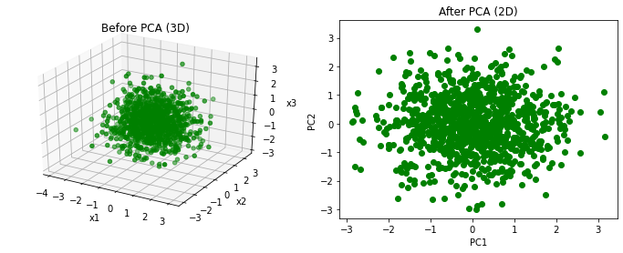

+++
title = "pca"
date = 2026-07-07
draft = false
tags = ["机器学习", "特征工程", "特征降维", "笔记"]
categories = ["机器学习"]
math = true
+++
主成分分析（Principal Component Analysis，PCA）是一种常用的降维技术，通过线性变换将高维数据投影到低维空间，同时保留数据的主要变化模式。


```python
import numpy as np
import matplotlib.pyplot as plt
from sklearn.decomposition import PCA
from sklearn.preprocessing import StandardScaler
```


```python
# 定义数据
X = np.random.randn(1000,3)
print(X.shape)
```

    (1000, 3)


```python
# 定义PCA对象
pca = PCA(n_components=2)
```


```python
# 应用PCA,降维处理
X_pca = pca.fit_transform(X)
print(X_pca.shape)
```

    (1000, 2)


至此我们会发现，输出的结果舍弃了一列，而这个舍弃真的是直接舍弃吗？显然不是，如果是扔掉一列的话，那就是特征选择的范畴了，那么这个PCA到底是怎么选择的呢？


```python
# 画图
fig = plt.figure(figsize=(12,4))
# 添加子图，3D数据可视化
ax1 = fig.add_subplot(121,projection='3d')
ax1.scatter(X[:,0],X[:,1],X[:,2],c='g')
ax1.set_title('Before PCA (3D)')
ax1.set_xlabel('x1')
ax1.set_ylabel('x2')
ax1.set_zlabel('x3')
# 2D
ax2 = fig.add_subplot(122)
ax2.scatter(X_pca[:,0],X_pca[:,1],c='g')
ax2.set_title('After PCA (2D)')
ax2.set_xlabel('PC1')
ax2.set_ylabel('PC2')
plt.show()
```


​    

​    


通过对比左右两张图，我们可以清晰地看到，PCA 并非简单粗暴地砍掉x1、x2、x3之中的有一个坐标轴，它的本质是在原始的三维空间中，寻找了一个 ‘最佳的二维投影平面’。PCA 将原有的坐标系进行了正交旋转，找到了数据分布最分散的两个新方向（PC1 和 PC2）。右侧的 2D 图，实际上是左侧 3D 数据在这个‘最佳投影面’上的影子。它舍弃的，是那个垂直于该投影面、数据分布最密集（方差最小、有效信息量最少）的维度方向。


```python
# 量化分析：查看每个主成分到底保留了多少信息
print("--- PCA 降维的信息保留量化分析 ---")
print(f"PC1 (第一主成分) 解释了 {pca.explained_variance_ratio_[0]*100:.2f}% 的原始方差")
print(f"PC2 (第二主成分) 解释了 {pca.explained_variance_ratio_[1]*100:.2f}% 的原始方差")

total_variance_retained = sum(pca.explained_variance_ratio_)
print(f"降维至2D后，总共保留了 {total_variance_retained*100:.2f}% 的原始信息")
print(f"被PCA舍弃的那个维度(PC3)，仅包含了 {(1-total_variance_retained)*100:.2f}% 的信息")
```

    --- PCA 降维的信息保留量化分析 ---
    PC1 (第一主成分) 解释了 34.71% 的原始方差
    PC2 (第二主成分) 解释了 33.27% 的原始方差
    降维至2D后，总共保留了 67.98% 的原始信息
    被PCA舍弃的那个维度(PC3)，仅包含了 32.02% 的信息


PCA 的选择依据是方差最大化。它优先保留了占据主导地位的 PC1 和 PC2。虽然数据的维度从 3 降低到了 2，但我们依然保留了绝大部分的原始信息，而那个被舍弃的维度对整体数据结构的贡献微乎其微。粗暴一点理解就是，我们有一个三维的物品，不断的旋转它找出一个最大的投影。

但是，计算机并不是靠“盲目旋转一圈去试错”来找这个方向的。 如果数据是 1000 维的，靠旋转试错的计算量是天文数字。计算机是通过线性代数（Linear Algebra） 瞬间“算”出这个最佳旋转角度的。

